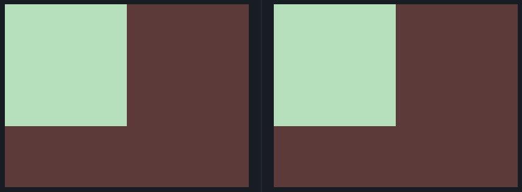
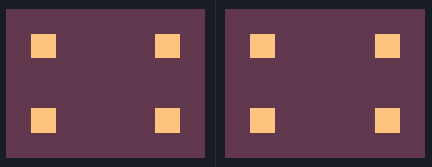
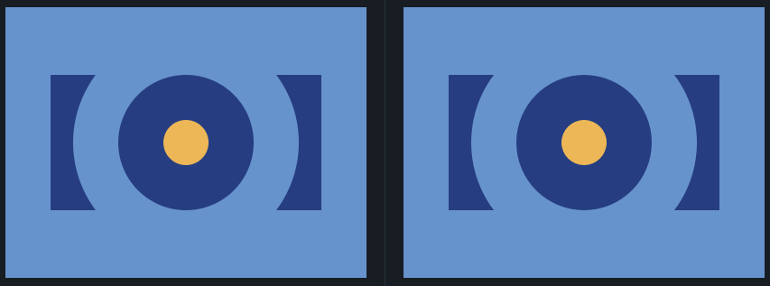
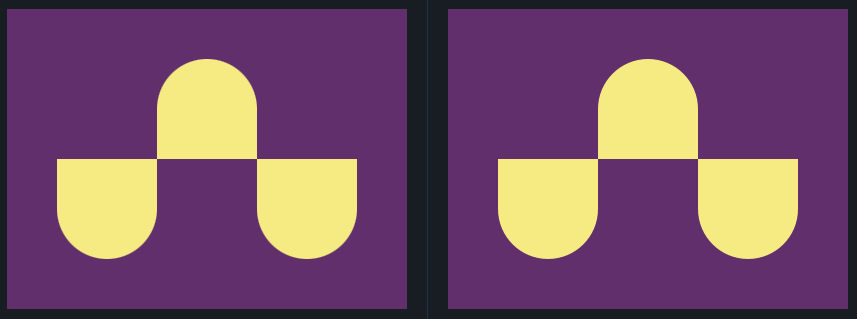
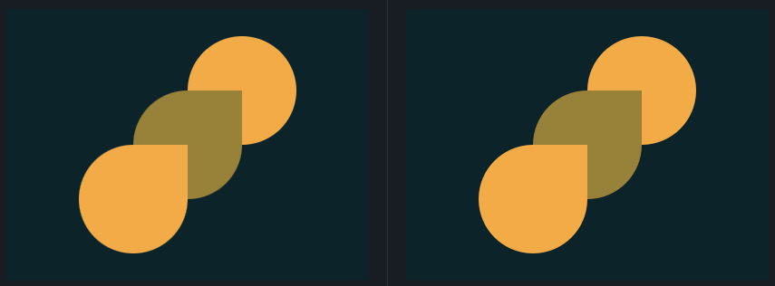
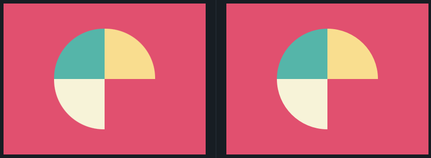
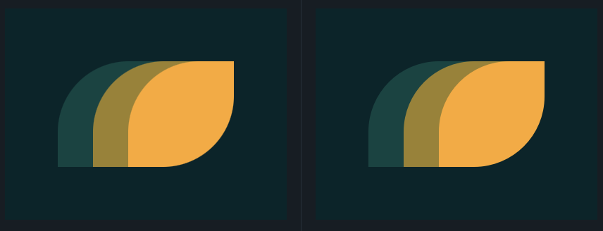
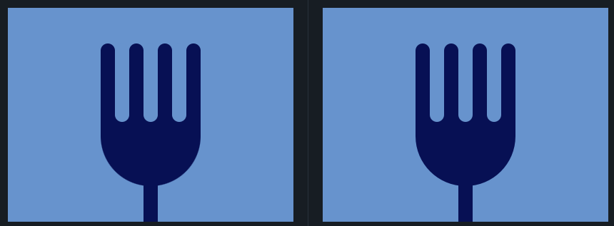

<h1 align="center">
Soluções
<a href="https://cssbattle.dev/" target="_blank">CSSBattle</a>
</h1>

## Índice

* [1. Simply Square](#1-simply-square)
* [2. Carrom](#2-carrom)
* [3. Push Button](#3-push-button)
* [4. Up n Downs](#4-up-n-downs)
* [5. Acid Rain](#5-acid-rain)
* [6. Missing Slice](#6-missing-slice)
* [7. Leafy Trail](#7-leafy-trail)
* [8. Forking Crazy](#8-forking-crazy)
***

## 1. Simply Square
Link do desafio: [CSSBattle](https://cssbattle.dev/play/1)



```css
<div></div>

<style>
  body {
    background:#5d3a3a;
    margin: 0;
  }

  div {
    width: 200px;
    height: 200px;
    background: #b5e0ba;
  }
</style>
```

***

## 2. Carrom
Link do desafio: [CSSBattle](https://cssbattle.dev/play/2)



```css
<div class="bl1"></div>
<div class="bl2"></div>
<div class="bl3"></div>
<div class="bl4"></div>

<style>
  body {
   background: #62374e;
    margin:0;
  }
  div {
    width: 50px;
    height: 50px;
    background: #fdc57b;
    position: absolute;
  }
  .bl1, .bl3 {
    margin: 50px;
  }
  .bl2, .bl4 {
    margin-left:300px;
  }
  .bl2, .bl1 {
    margin-top: 50px;
  }
  .bl4, .bl3 {
    margin-top: 200px;
  }
</style>
```

***

## 3. Push Button
Link do desafio: [CSSBattle](https://cssbattle.dev/play/3)



```css
<div class="forma-azul-escuro" id="retangulo-azul-escuro"></div>
<div class="circulo-azul-claro"></div>
<div class="forma-azul-escuro" id="circulo-azul-escuro"></div>
<div class="circulo-amarelo"></div>

<style>
  body {
    background: #6592CF;
    margin: 0px;
  }
  div {
  position: absolute;
  }
  .forma-azul-escuro {
    background: #243D83;
  }
  #retangulo-azul-escuro {
    width: 300px;
    height: 150px;
    margin: 75px 0 0 50px;
  }
  .circulo-azul-claro,  #circulo-azul-escuro, .circulo-amarelo {
    border-radius: 100%;
  }
  .circulo-azul-claro {
    background: #6592CF;
    width: 250px;
    height: 250px;
    margin: 25px 0 0 75px;
  }
  #circulo-azul-escuro {
    width: 150px;
    height: 150px;
    margin: 75px 0 0 125px;
  }
  .circulo-amarelo {
    background: #EEB850;
    width: 50px;
    height: 50px;
    margin: 125px 0 0 175px;
  }
</style>
```

## 4. Up n Downs
Link do desafio: [CSSBattle](https://cssbattle.dev/play/4)



```css
<div class="top"></div>
<div class="left"></div>
<div class="rigth"></div>
<style>
  body {
    background: #62306D;
    margin: 0px;
  }
  div {
    background: #F7EC7D;
    position: absolute;
    width: 100px;
    height: 100px;
  }
  .top {
    margin: 50px 150px;
    border-radius: 50px 50px 0 0;
  }
  .left, .rigth {
    border-radius: 0px 0px 50px 50px;
  }
  .left {
    margin: 150px 50px;
  }
  .rigth {
    margin: 150px 250px;
  }
</style>
```

***

## 5. Acid Rain
Link do desafio: [CSSBattle](https://cssbattle.dev/play/5)



```css
<div class="circle-orange"></div>
<div class="drop-green"></div>
<div class="drop-orange"></div>

<style>
  body {
    background: #0B2429;
    margin: 0;
  }
  div {
    width: 120px;
    height: 120px;
    position: absolute;
  }
  .circle-orange, .drop-orange {
    background: #F3AC3C;
  } 
  .drop-green, .drop-orange {
    border-radius: 100% 0 100% 100%;
  }
  .circle-orange {
    border-radius: 100%;
    margin: 30px 200px;
  }
  .drop-green {
    background: #998235;
    margin: 90px 140px;
  }
  .drop-orange {
    margin: 150px 80px;
  }
</style>
```

***

## 6. Missing Slice
Link do desafio: [CSSBattle](https://cssbattle.dev/play/6)



```css
<div class="green"></div>
<div class="yellow"></div>
<div class="white"></div>

<style>
  body {
    background: #E3516E;
    margin: 0;
  }
  div {
    width: 100px;
    height: 100px;
    position: absolute;
  }
  .green {
    background: #51B5A9;
    border-radius: 100% 0 0;
    margin: 50px 0 0 100px;
  }
  .yellow {
    background: #FADE8B;
    border-radius: 0 100% 0 0;
    margin: 50px 0 0 200px;
  }
  .white {
    background: #F7F3D7;
    border-radius: 0 0 0 100%;
    margin: 150px 0 0 100px;
  }
</style>
```

***

## 7. Leafy Trail
Link do desafio: [CSSBattle](https://cssbattle.dev/play/7)



```css
<div class="dark-green"></div>
<div class="light-green"></div>
<div class="yellow"></div>

<style>
  body{
    background: #0B2429;
    margin: 0;
  }
  div {
    width: 150px;
    height: 150px;
    position: absolute;
  }
  .dark-green, .light-green, .yellow {
    border-radius: 67% 0;
  }
  .dark-green{
    background: #1A4341;
    margin: 75px 0 0 75px;
  }
  .light-green {
    background: #998235;
    margin: 75px 0 0 125px;
  }
  .yellow {
    background: #F3AC3C;
    margin: 75px 0 0 175px;
  }
</style>
```

***

## 8. Forking Crazy
Link do desafio: [CSSBattle](https://cssbattle.dev/play/8)



```css
<div class="fork-handle"></div>
<div class="fork-body"></div>
<div class="tooth-one"></div>
<div class="tooth-two"></div>
<div class="tooth-three"></div>
<div class="tooth-four"></div>
<div class="space-one"></div>
<div class="space-two"></div>
<div class="space-three"></div>

<style>
  body{
    background: #6592CF;
    margin: 0;
  }
  div {
    width: 100px;
    height: 100px;
    background: #060F55;
    position: absolute;
  }
  .fork-handle {
    margin: 200px 190px;
    width: 20px;
  }
  .fork-body{
    margin: 80px 130px;
    height: 170px;
    width: 140px;
    border-radius: 10px 10px 90px 90px;
  }
  .tooth-one, .tooth-two, .tooth-three, .tooth-four {
    background: #060F55;
    width: 20px;
    border-radius: 90px;
  } 
  .tooth-one{
    margin: 50px 130px;
  }
  .tooth-two {
    margin: 50px 170px;
  }
  .tooth-three {
    margin: 50px 210px;
  }
  .tooth-four {
    margin: 50px 250px;
  }
  .space-one, .space-two, .space-three {
    background: #6592CF;
    width: 20px;
    height: 110px;
    border-radius: 90px;
  }
  .space-one {
    margin: 50px 150px;
  }
  .space-two {
    margin: 50px 190px;
  }
  .space-three {
    margin: 50px 230px;
  }
</style>
```

***