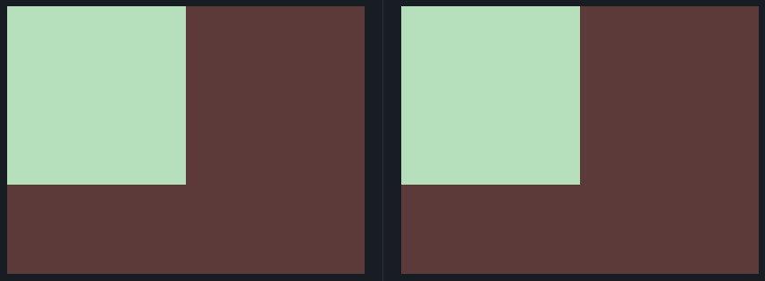

## 1. Simply Square
Link do desafio: [CSSBattle](https://cssbattle.dev/play/1)



```css
<div></div>

<style>
  body {
    background:#5d3a3a;
    margin: 0;
  }

  div {
    width: 200px;
    height: 200px;
    background: #b5e0ba;
  }
</style>
```
