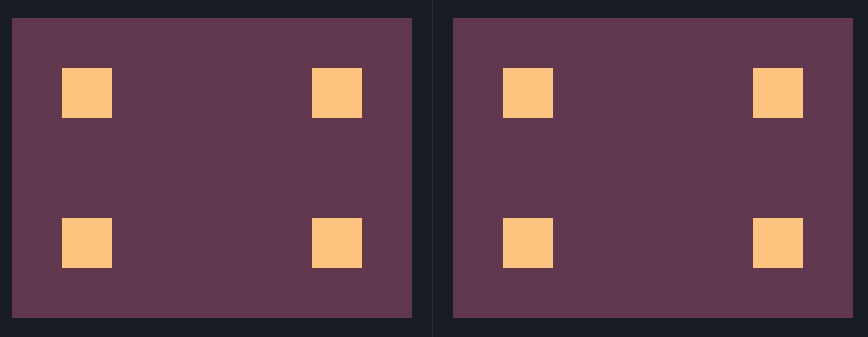

## 2. Carrom
Link do desafio: [CSSBattle](https://cssbattle.dev/play/2)



```css
<div class="bl1"></div>
<div class="bl2"></div>
<div class="bl3"></div>
<div class="bl4"></div>

<style>
  body {
   background: #62374e;
    margin:0;
  }
  div {
    width: 50px;
    height: 50px;
    background: #fdc57b;
    position: absolute;
  }
  .bl1, .bl3 {
    margin: 50px;
  }
  .bl2, .bl4 {
    margin-left:300px;
  }
  .bl2, .bl1 {
    margin-top: 50px;
  }
  .bl4, .bl3 {
    margin-top: 200px;
  }
</style>
```