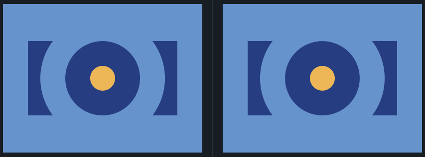

## 3. Push Button
Link do desafio: [CSSBattle](https://cssbattle.dev/play/3)



```css
<div class="forma-azul-escuro" id="retangulo-azul-escuro"></div>
<div class="circulo-azul-claro"></div>
<div class="forma-azul-escuro" id="circulo-azul-escuro"></div>
<div class="circulo-amarelo"></div>

<style>
  body {
    background: #6592CF;
    margin: 0px;
  }
  div {
  position: absolute;
  }
  .forma-azul-escuro {
    background: #243D83;
  }
  #retangulo-azul-escuro {
    width: 300px;
    height: 150px;
    margin: 75px 0 0 50px;
  }
  .circulo-azul-claro,  #circulo-azul-escuro, .circulo-amarelo {
    border-radius: 100%;
  }
  .circulo-azul-claro {
    background: #6592CF;
    width: 250px;
    height: 250px;
    margin: 25px 0 0 75px;
  }
  #circulo-azul-escuro {
    width: 150px;
    height: 150px;
    margin: 75px 0 0 125px;
  }
  .circulo-amarelo {
    background: #EEB850;
    width: 50px;
    height: 50px;
    margin: 125px 0 0 175px;
  }
</style>
```