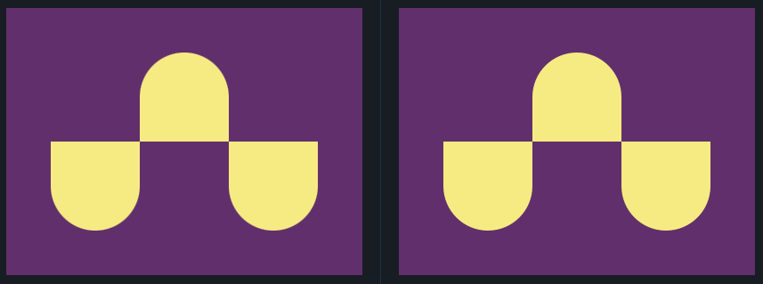

## 4. Up n Downs
Link do desafio: [CSSBattle](https://cssbattle.dev/play/4)



```css
<div class="top"></div>
<div class="left"></div>
<div class="rigth"></div>
<style>
  body {
    background: #62306D;
    margin: 0px;
  }
  div {
    background: #F7EC7D;
    position: absolute;
    width: 100px;
    height: 100px;
  }
  .top {
    margin: 50px 150px;
    border-radius: 50px 50px 0 0;
  }
  .left, .rigth {
    border-radius: 0px 0px 50px 50px;
  }
  .left {
    margin: 150px 50px;
  }
  .rigth {
    margin: 150px 250px;
  }
</style>
```