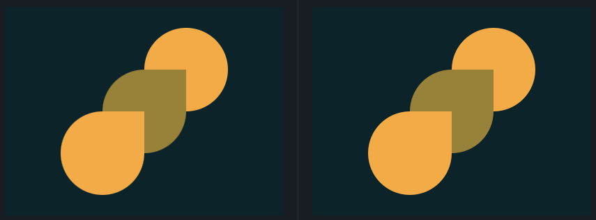

## 5. Acid Rain
Link do desafio: [CSSBattle](https://cssbattle.dev/play/5)



```css
<div class="circle-orange"></div>
<div class="drop-green"></div>
<div class="drop-orange"></div>

<style>
  body {
    background: #0B2429;
    margin: 0;
  }
  div {
    width: 120px;
    height: 120px;
    position: absolute;
  }
  .circle-orange, .drop-orange {
    background: #F3AC3C;
  } 
  .drop-green, .drop-orange {
    border-radius: 100% 0 100% 100%;
  }
  .circle-orange {
    border-radius: 100%;
    margin: 30px 200px;
  }
  .drop-green {
    background: #998235;
    margin: 90px 140px;
  }
  .drop-orange {
    margin: 150px 80px;
  }
</style>
```
