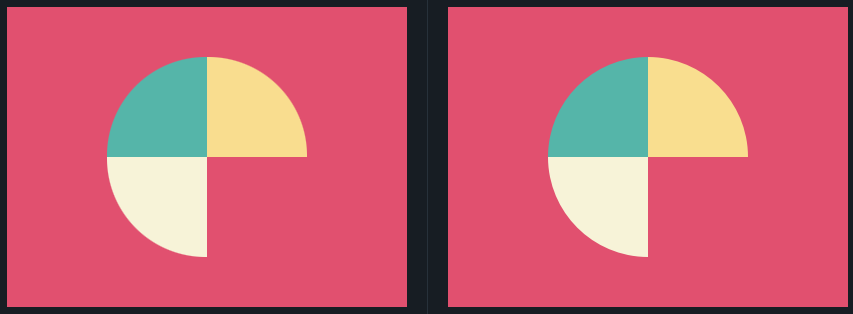

## 6. Missing Slice
Link do desafio: [CSSBattle](https://cssbattle.dev/play/6)



```css
<div class="green"></div>
<div class="yellow"></div>
<div class="white"></div>

<style>
  body {
    background: #E3516E;
    margin: 0;
  }
  div {
    width: 100px;
    height: 100px;
    position: absolute;
  }
  .green {
    background: #51B5A9;
    border-radius: 100% 0 0;
    margin: 50px 0 0 100px;
  }
  .yellow {
    background: #FADE8B;
    border-radius: 0 100% 0 0;
    margin: 50px 0 0 200px;
  }
  .white {
    background: #F7F3D7;
    border-radius: 0 0 0 100%;
    margin: 150px 0 0 100px;
  }
</style>
```