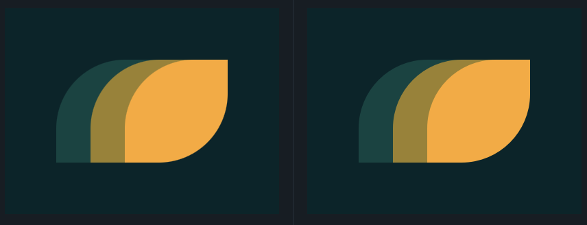

## 7. Leafy Trail
Link do desafio: [CSSBattle](https://cssbattle.dev/play/7)



```css
<div class="dark-green"></div>
<div class="light-green"></div>
<div class="yellow"></div>

<style>
  body{
    background: #0B2429;
    margin: 0;
  }
  div {
    width: 150px;
    height: 150px;
    position: absolute;
  }
  .dark-green, .light-green, .yellow {
    border-radius: 67% 0;
  }
  .dark-green{
    background: #1A4341;
    margin: 75px 0 0 75px;
  }
  .light-green {
    background: #998235;
    margin: 75px 0 0 125px;
  }
  .yellow {
    background: #F3AC3C;
    margin: 75px 0 0 175px;
  }
</style>
```