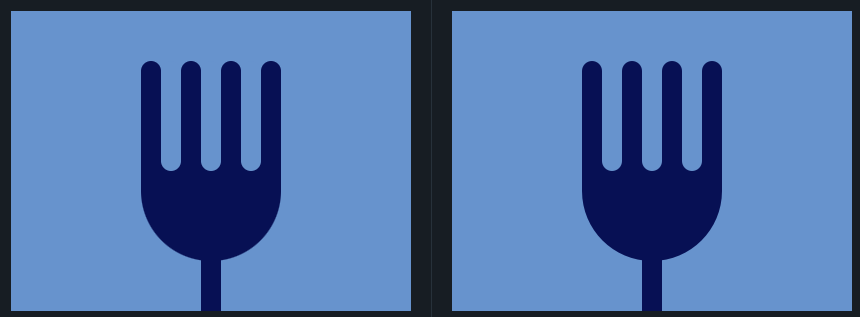

## 8. Forking Crazy
Link do desafio: [CSSBattle](https://cssbattle.dev/play/8)



```css
<div class="fork-handle"></div>
<div class="fork-body"></div>
<div class="tooth-one"></div>
<div class="tooth-two"></div>
<div class="tooth-three"></div>
<div class="tooth-four"></div>
<div class="space-one"></div>
<div class="space-two"></div>
<div class="space-three"></div>

<style>
  body{
    background: #6592CF;
    margin: 0;
  }
  div {
    width: 100px;
    height: 100px;
    background: #060F55;
    position: absolute;
  }
  .fork-handle {
    margin: 200px 190px;
    width: 20px;
  }
  .fork-body{
    margin: 80px 130px;
    height: 170px;
    width: 140px;
    border-radius: 10px 10px 90px 90px;
  }
  .tooth-one, .tooth-two, .tooth-three, .tooth-four {
    background: #060F55;
    width: 20px;
    border-radius: 90px;
  } 
  .tooth-one{
    margin: 50px 130px;
  }
  .tooth-two {
    margin: 50px 170px;
  }
  .tooth-three {
    margin: 50px 210px;
  }
  .tooth-four {
    margin: 50px 250px;
  }
  .space-one, .space-two, .space-three {
    background: #6592CF;
    width: 20px;
    height: 110px;
    border-radius: 90px;
  }
  .space-one {
    margin: 50px 150px;
  }
  .space-two {
    margin: 50px 190px;
  }
  .space-three {
    margin: 50px 230px;
  }
</style>
```